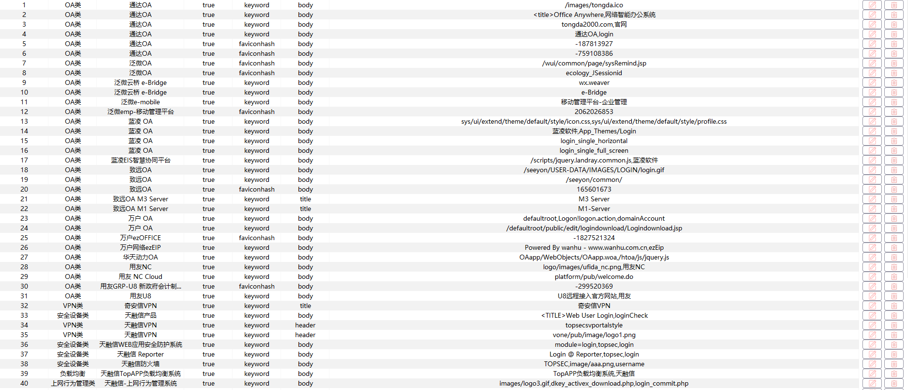

# Burp 指纹识别

> 攻击过程中，我们通常会用浏览器访问一些资产，该BurpSuite插件实现被动指纹识别+网站提取链接+OA爆破，可帮助我们发现更多资产。

## 功能如下
> 下述功能会在2024年5月底完成，如果有更好的建议都可以提，然后再麻烦点个Star，创作不易，打造最强指纹识别库和弱口令探测库
- [x] 浏览器被动指纹识别，已集成Ehole指纹识别库
- [x] 提取网站的URL链接和解析JS文件中的URL链接后进行指纹识别
- [x] 开界面进行指纹库修改，可导入、导出、重置
- [x] 优化已有指纹库，区分重点指纹和常见指纹，补充部分实战热门漏洞的指纹，方便直接一键getshell

- [ ] 优化算法，提升性能、减少内存开销
- [ ] 收集github上常见的EXP工具，提起其含有EXP漏洞的指纹，当成重要指纹，一旦页面出现该指纹，就表示有戏有戏

- 1、https://github.com/R4gd0ll/I-Wanna-Get-All
- 2、https://github.com/YinWC/2021hvv_vul
- 3、https://github.com/zhzyker/vulmap
- 4、https://github.com/SecWiki/CMS-Hunter
- 5、https://github.com/coffeehb/Some-PoC-oR-ExP
- 6、https://github.com/White-hua/Apt_t00ls
- 7、https://github.com/biggerwing/nsfocus-rsas-knowledge-base
- [ ] 优化GUI，指纹识别出来后，可以快速查看对应的利用EXP的github地址
- [ ] OA类弱口令爆破
- [ ] 与本地Packer Fuzzer JS扫描器配合发现隐秘漏洞

## 支持检测指纹

- [x] 通达OA
- [x] 致远OA
- [x] 蓝凌OA
- [x] 泛微OA
- [x] 万户OA
- [x] 东华OA
- [x] 信呼OA
- [x] 等等

## 支持弱口令爆破组件
- [ ] 通达OA
- [ ] 致远OA
- [ ] 蓝凌OA
- [ ] 泛微OA
- [ ] 万户OA
- [ ] 东华OA
- [ ] 信呼OA

## 优化/建议/问题反馈群

## 免责声明

本工具仅作为安全研究交流，请勿用于非法用途。如您在使用本工具的过程中存在任何非法行为，您需自行承担相应后果，本人将不承担任何法律及连带责任。
